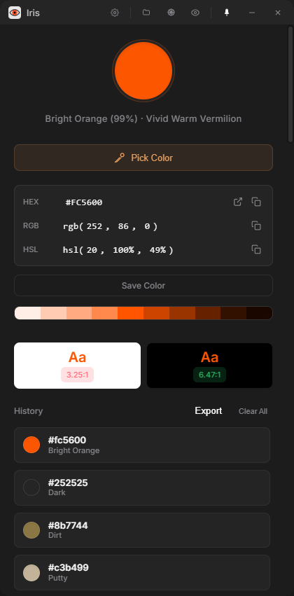
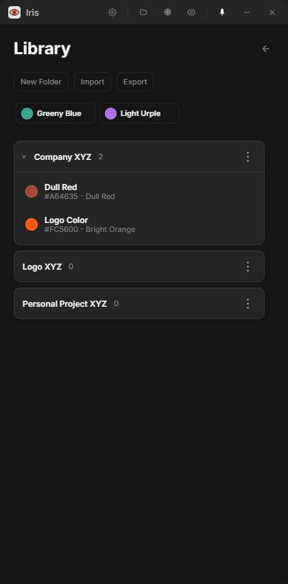

<div align="center">
  <h1>Iris</h1>
  <p>A lightweight, always-on-top color picker for Windows with live preview, intelligent color naming, a persistent color library, and real-time accuracy data. Built with Tauri and Rust.</p>
</div>

## Quick Overview

Iris lets you capture, inspect, organize, and understand colors directly from your screen. It combines a live color preview with a persistent color library and an intelligent naming engine backed by 948 crowdsourced color names, giving you instant, accurate descriptions of any color you hover over -- complete with match confidence percentages. Designed to be fast, stay out of your way until you need it, and give you immediate access to color formats, saved palettes, harmonic palettes, and accessibility data.

## Showcase

<div align="center">
  
  
</div>

## Features

- **Color Library** -- Save important colors into a persistent library, organize them into folders, drag colors between folders, and import or export library backups.
- **Live Color Preview** -- See the color under your cursor update in real-time as you move across the screen. Powered by Win32 `GetPixel` for instant, zero-latency pixel reads.
- **Intelligent Color Naming** -- Every color is matched against the [xkcd color survey](https://xkcd.com/color/rgb/) database of 948 crowdsourced names (e.g., "Dusty Rose", "Sage", "Steel Blue") with a match accuracy percentage.
- **Descriptive Labels** -- Each color also gets a generated descriptor based on hue (16 segments), saturation (5 levels), lightness, and warm/cool temperature, e.g. `Sage (98%) - Muted Cool Green`.
- **Eyedropper with Loupe** -- Native magnifying loupe for pixel-precise picking, combined with live preview.
- **Color Formats** -- View and copy HEX, RGB, and HSL values with a single click.
- **Color History** -- Every picked color is saved to history for quick access.
- **Harmonics** -- Generate complementary, analogous, and triadic palettes from any color.
- **UI Scale** -- View a full lightness scale (100-950) for any selected color.
- **Accessibility** -- WCAG contrast ratios against white and black, plus color blindness simulation (protanopia, deuteranopia, tritanopia).
- **Global Shortcuts** -- Two configurable shortcuts:
  - *Global Picker* -- Opens Iris and starts the color picker.
  - *Quick Pick* -- Opens the picker, copies the HEX, and closes the window automatically.
- **System Tray** -- Minimizes to the system tray. Right-click to show or quit.
- **Always on Top** -- Toggle pin to keep Iris above other windows.
- **Dark / Light Theme** -- Switch between dark and light mode in settings.
- **Auto-Start** -- Optionally launch Iris on system startup.

## Installation

Download the latest `.msi` installer from the [Releases](../../releases) page and run it. Iris will be available in your Start Menu.

## Development

Requires [Node.js](https://nodejs.org/) and [Rust](https://www.rust-lang.org/tools/install).

```sh
npm install
npm run dev
```

## Build

```sh
npm run build
```

Release installers are written to `src-tauri/target/release/bundle/`:
- `msi/Iris_x.x.x_x64_en-US.msi` -- Windows MSI installer
- `nsis/Iris_x.x.x_x64-setup.exe` -- Windows setup executable

## Tech Stack

- **Frontend** -- HTML, CSS, JavaScript
- **Backend** -- Rust (Tauri 2.0)
- **Live Preview** -- Win32 `GetPixel` API for instant single-pixel reads
- **Color Naming** -- 948-color xkcd crowdsourced database with perceptual distance matching
- **UI Picker** -- Chrome EyeDropper API (magnifying loupe) with Rust fallback

## License

MIT
